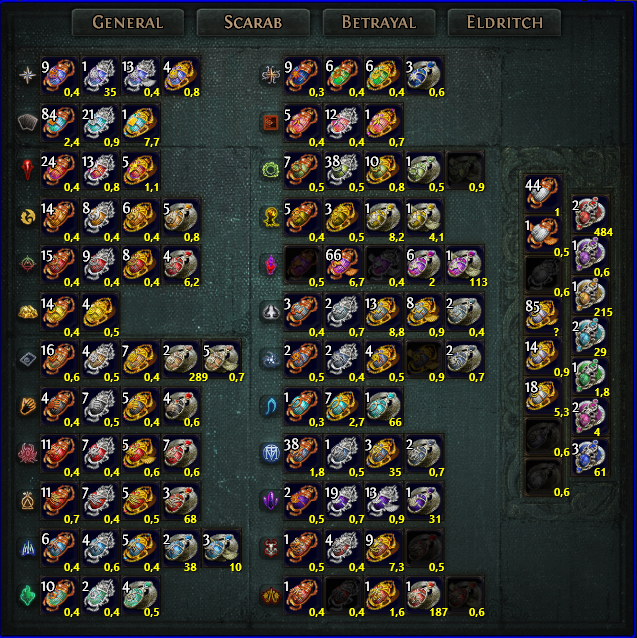

# ScarabLens

Transparent desktop overlay for Path of Exile that shows scarab prices from poe.ninja directly over your stash tab.

> **This build is for 1080p windowed fullscreen.**

## Requirements

- Windows 10/11
- Path of Exile running in **windowed fullscreen at 1920×1080**

## Usage

1. Run `ScarabLens.exe`
2. Open your scarab stash tab in Path of Exile
3. Press **Ctrl+Alt+S** to toggle the overlay on/off

The overlay starts hidden. Prices are fetched from poe.ninja on launch and refreshed every hour.

## Coordinate Helper (for maintainers)

Press **F2** to enter coordinate mode — the overlay becomes interactive and shows live cursor pixel coordinates. Use this to adjust slot positions in `Models/SlotPositions.cs` if the layout ever changes. Press **F2** again to exit.
