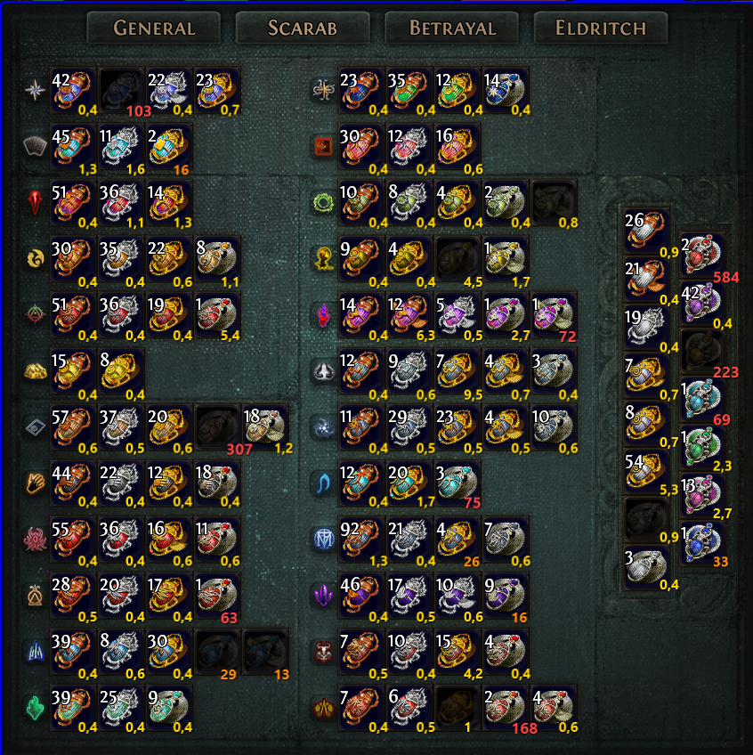

# ScarabLens

# [Download latest release](https://github.com/spumi322/ScarabLens/releases/latest/download/ScarabLens.zip)

Transparent desktop overlay for Path of Exile that shows scarab prices from poe.ninja directly over your stash tab.
Works on windowed fullscreen and any conventional non ultra-wide resolution.

## Requirements

- Windows 10/11
- Path of Exile running in **windowed fullscreen non ultra-wide** 

## Usage

1. Run `ScarabLens.exe`
2. Open your scarab stash tab in Path of Exile
3. Press **ctrl+alt+s** to toggle the overlay on/off

The overlay starts hidden. Prices are fetched from poe.ninja on launch and refreshed every hour.

## Resolution scaling

The overlay auto-scales to the PoE window and handles Windows display scaling (125%, 150%, etc.) correctly.

## Coordinate Helper (for maintainers)

Press **F2** to enter coordinate mode — the overlay becomes interactive and shows live cursor pixel coordinates. Use this to adjust slot positions in `Models/SlotPositions.cs` if the layout ever changes. Press **F2** again to exit.

